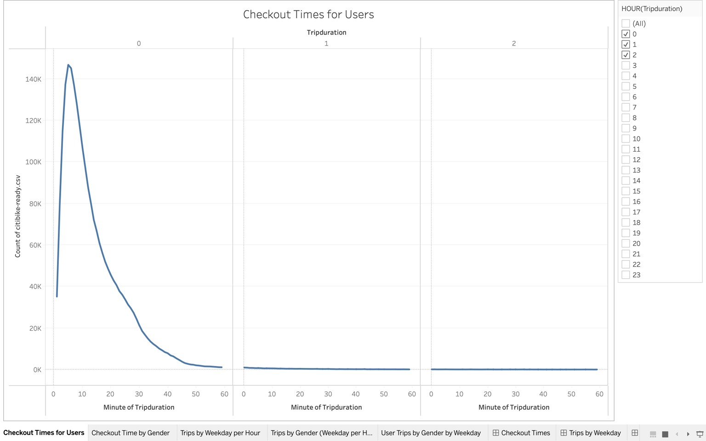
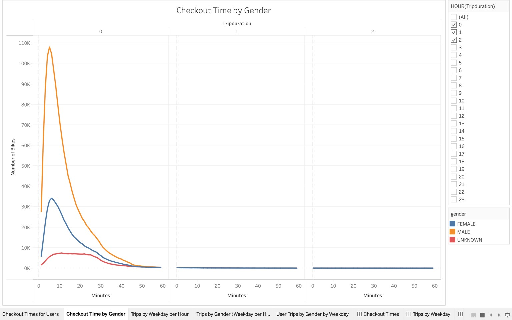
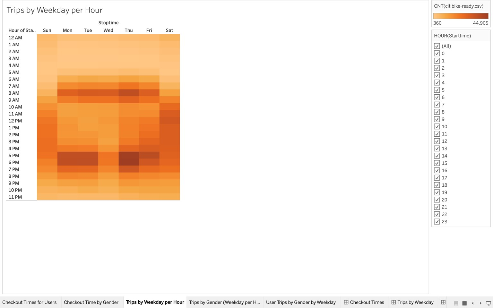
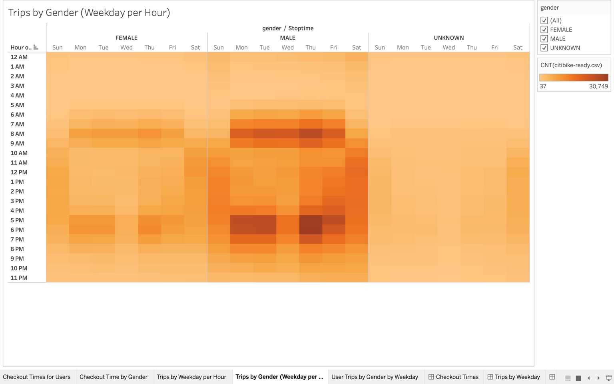
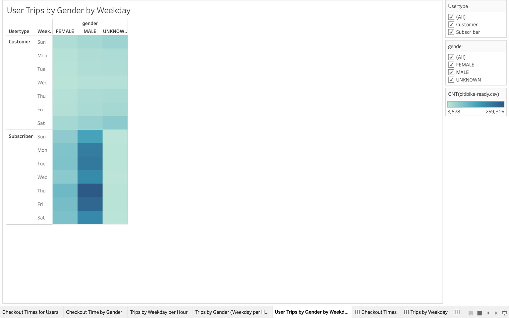
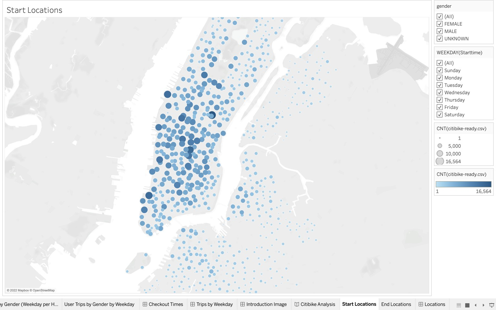
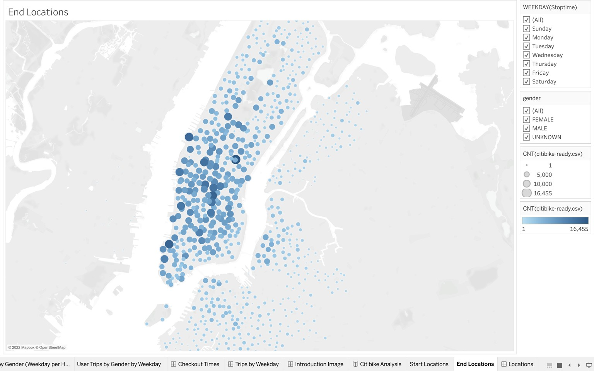
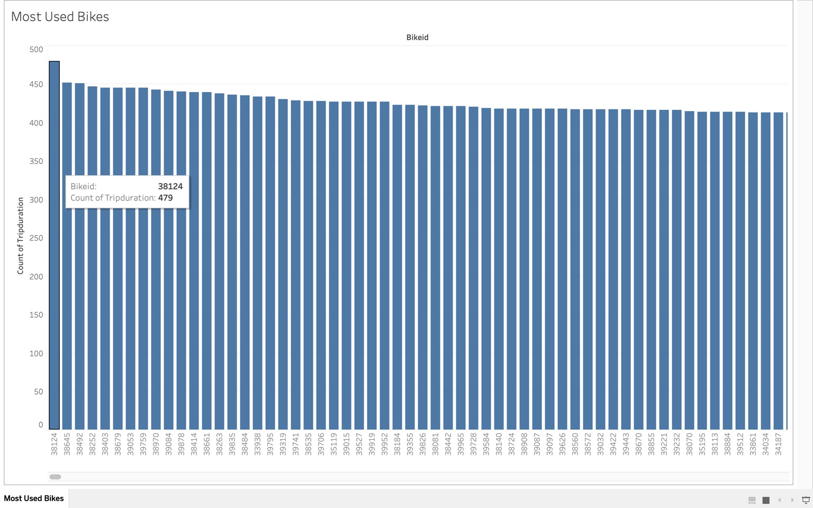
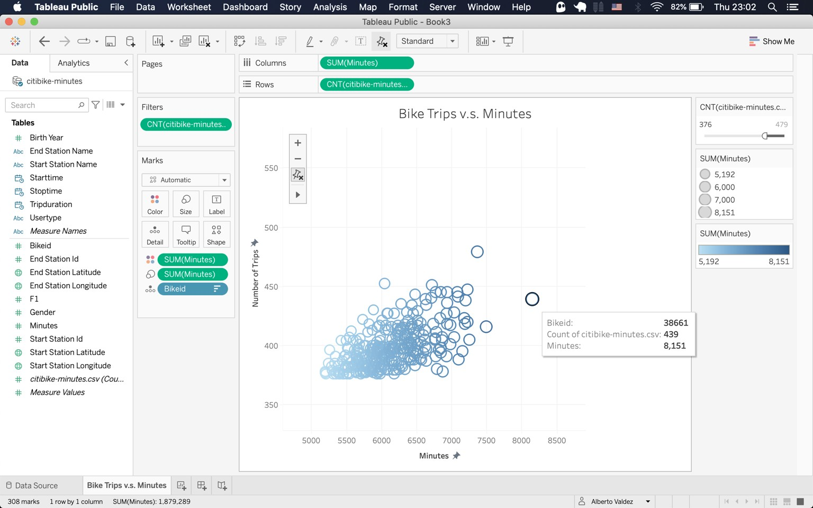

- [Citibike Analysis](#orgd322ef0)
  - [Overview](#org942f61a)
  - [Results](#org5bfb020)
  - [Summary](#orgb79285a)


<a id="orgd322ef0"></a>

# Citibike Analysis


<a id="org942f61a"></a>

## Overview

In this project we had the mission to provide answers to the stakeholder&rsquo;s questions. The best way to do it is by using a sequence of visualizations that helps us tell a compelling story. In order to achieve such task we sought the help of Tableau which is a great solution for visualization-heavy projects.


<a id="org5bfb020"></a>

## Results

The main result is the following dashboard.

[Dashboard](https://public.tableau.com/views/CitibikeAnalysis_16650997982650/CitibikeAnalysis?:language=en-US&:display_count=n&:origin=viz_share_link)

In order to create it we constructed many visualizations that answer different questions.

1.  Checkout time for users refers to the trip length in minutes for each user. Most of which take less than 10 minutes and almost 100% percent take an hour. We can see three sections, each per hour of use, and as we mentioned, most data is in the first section (0-1 hours).



1.  We continue with the same data from before but this time we split it by gender. This helps us get an idea of both the distribution of each gender over time and how it relates to others.



1.  This is a calendar heatmap that shows us the critical hours and days for each trip. The obvious reference is the work hours around 7 A.M. and 5 P.M. Then on weekends we see a more balanced distribution.



1.  Following up with the calendar view, we separate by gender once again and we can see a similar distribution to the previous gender-based visualization but the relationship between the data in the work hours and the rest of the day remains the same.



1.  Finally we can condense the previous two visualizations in a single calendar heatmap that tells us a similar story but focused on the days of the week rather than the hours of the day. This is a much better way to appreaciate the week than the previous visualization as it is much simpler.



1.  We added one visualization for the starting locations which we can filter by gender and weekday. The colors and size help us see the areas with more trips, giving us a better sense of density in a map.



1.  Finally, we make a similar visualization for the ending areas which is very similar to the previous one. However, there are a few more spots at the city center which tells us that there is just a bit more traffic towards the city than from it.




<a id="orgb79285a"></a>

## Summary

This analysis gives us a better sense of our clients demographic and shows us the patterns in trip times and locations of the users in general and by gender. We can now make better decisions in multiple areas of our business. For example, which demographic to market and make publicity for as well as the times of the day and day of the week when we can make repairs to the bicycles based on the demand.

We can add two more visualizations.

1.  If we get the count data per bike id, we can get a better idea of which bikes are the most used.



1.  However, if we create a new field with the trip duration in minutes only, we can get a better idea of which bikes have been used the most.



This is the behind the scenes on converting the data to minutes using Python.

```python
import pandas as pd
from pathlib import Path


resources = Path('resources')
df = pd.read_csv(resources / 'citibike-ready.csv')
asmin = lambda x: 60 * x[0] + x[1] + x[2]/60
frmt = lambda x: asmin([float(i) for i in x.split(" ")[1].split(':')])
df['minutes'] = df['tripduration'].map(frmt)
print(df[['bikeid', 'minutes']].head())
df.to_csv(resources / 'citibike-minutes.csv')
```

       bikeid    minutes
    0   35305   6.550000
    1   38822  10.450000
    2   18373  18.866667
    3   25002  29.666667
    4   31198  25.283333

Tableau has incredible potential and usability for presenting data analysis but it is most powerful whenever we combine it with proper ETL and data preparation. Then the answers come easily by simply dragging a few visualizations around.
